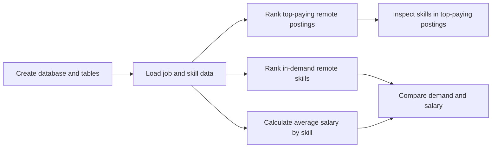
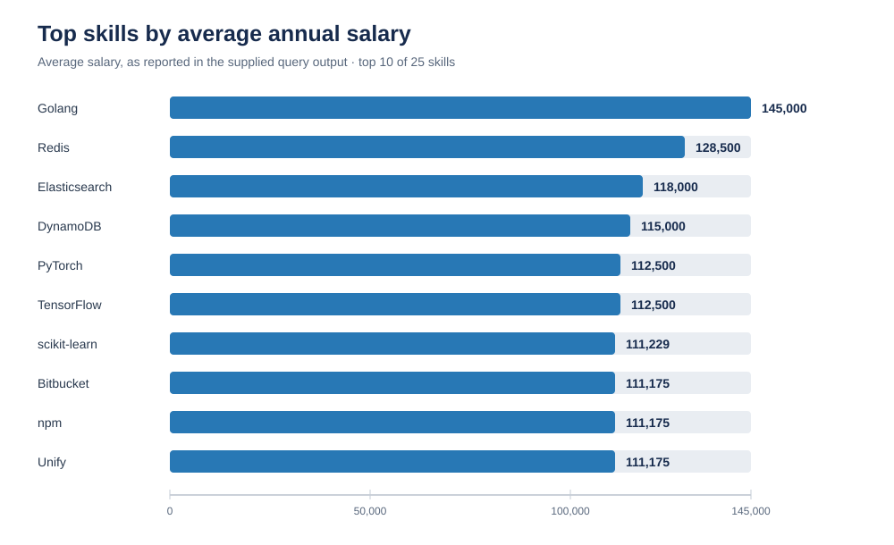
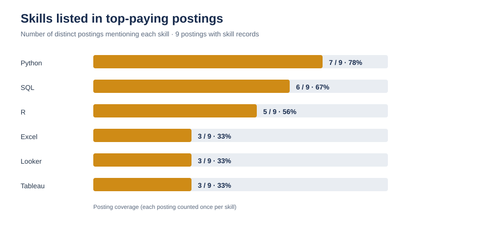

# SQL Data Analysis: Data Analyst Job Market

An SQL portfolio project exploring remote Data Analyst opportunities, the skills employers request, and how average salary varies by skill. The repository includes PostgreSQL scripts for database setup and five focused analyses.

## Project questions

1. Which remote Data Analyst job postings have the highest reported annual salaries?
2. Which skills appear in those top-paying postings?
3. Which skills are most in demand in remote Data Analyst postings?
4. Which skills are associated with the highest average salaries?
5. Which skills combine job demand with higher average salary?

## Workflow



## Repository structure

```text
sql_data_analysis/
├── sql_load/
│   ├── 1_create_database.sql
│   ├── 2_create_tables.sql
│   └── 3_modify_tables.sql
└── projects_sql/
    ├── 1_top_paying_job.sql
    ├── 2_top_paying_job_skills.sql
    ├── 3_top_demanded_skills.sql
    ├── 4_top_paying_skills.sql
    └── 5_optimal_skills.sql
```

## Analyses

| Script | Analysis |
|---|---|
| [`1_top_paying_job.sql`](projects_sql/1_top_paying_job.sql) | Ranks up to 10 Data Analyst postings with a reported salary and `job_location = 'Anywhere'`. |
| [`2_top_paying_job_skills.sql`](projects_sql/2_top_paying_job_skills.sql) | Lists the skills attached to the top-paying postings. |
| [`3_top_demanded_skills.sql`](projects_sql/3_top_demanded_skills.sql) | Counts skill demand for remote Data Analyst postings. |
| [`4_top_paying_skills.sql`](projects_sql/4_top_paying_skills.sql) | Ranks skills by average reported salary across Data Analyst postings with a salary. |
| [`5_optimal_skills.sql`](projects_sql/5_optimal_skills.sql) | Combines remote-skill demand and average salary to help compare skill opportunities. |

## Selected results

The charts below summarize the outputs shared for this project. Salary figures use the source's reported annual salary units. The available output does not include per-skill sample sizes, so salary averages should be read as descriptive rather than as a guarantee of pay.

### Highest average salary skills



Golang has the highest average in the supplied results at 145,000, followed by Redis at 128,500 and Elasticsearch at 118,000. Specialized programming, database, and machine-learning tools appear near the top of this salary ranking.

### Most frequent skills in the top-paying postings



In the supplied top-posting sample, Python appears in 7 of 9 postings with listed skills, SQL in 6, and R in 5. The chart counts postings that list a skill; it does not count repeated rows as additional demand.

## Requirements and setup

- PostgreSQL
- The job-postings and skill data loaded into the tables created by the setup scripts
- A PostgreSQL client such as `psql`, pgAdmin, or DBeaver

The SQL uses PostgreSQL features including `ILIKE`, Boolean values, and `NUMERIC`. The repository contains database/table setup and CSV-loading instructions, but the source CSV data must be obtained and loaded separately. The current loading script includes a local absolute path that must be adapted to your environment.

### Setup

1. Create the database by running [`sql_load/1_create_database.sql`](sql_load/1_create_database.sql).
2. Connect to the `sql_course` database and run [`sql_load/2_create_tables.sql`](sql_load/2_create_tables.sql).
3. Load the four CSV datasets into the matching tables. The current [`sql_load/3_modify_tables.sql`](sql_load/3_modify_tables.sql) contains server-side `COPY` statements with an environment-specific absolute path; update those paths before running it, or use PostgreSQL client-side `\copy` with paths on your computer.
4. Run the analysis scripts in `projects_sql/`.

## Data and interpretation notes

- The top-posting skill chart is based on 9 distinct postings with skill records in the supplied output; the 10th ranked posting may not have had a matching skill record in that output.
- A duplicated SAS row was present in the supplied top-posting skill export and was counted once per posting.
- Salary-by-skill averages can be influenced by how many postings contain each skill. The supplied salary output does not include those sample sizes.
- The queries use different scopes: the top-job query filters `job_location = 'Anywhere'`; demand and optimal-skill queries filter `job_work_from_home = TRUE`; the salary-by-skill query includes all matching Data Analyst postings with a reported salary.
- Skill-salary associations are descriptive and do not show that a skill causes higher pay.

## Skills demonstrated

SQL joins, filtering, aggregation, grouping, ordering, CTEs, database/table setup, and translating job-market questions into repeatable analyses.

